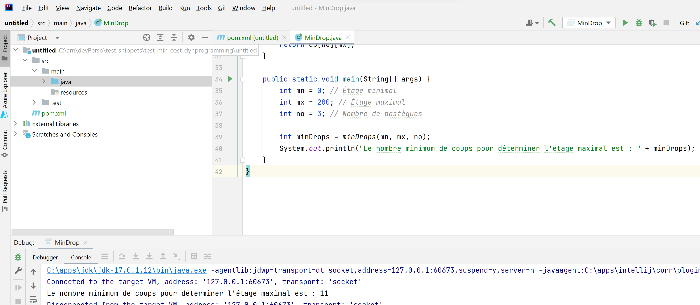
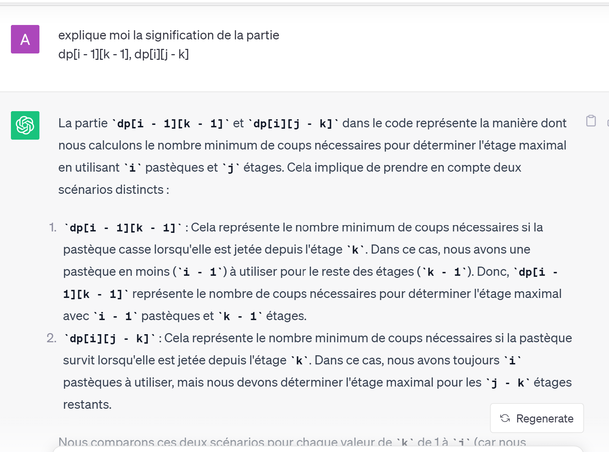
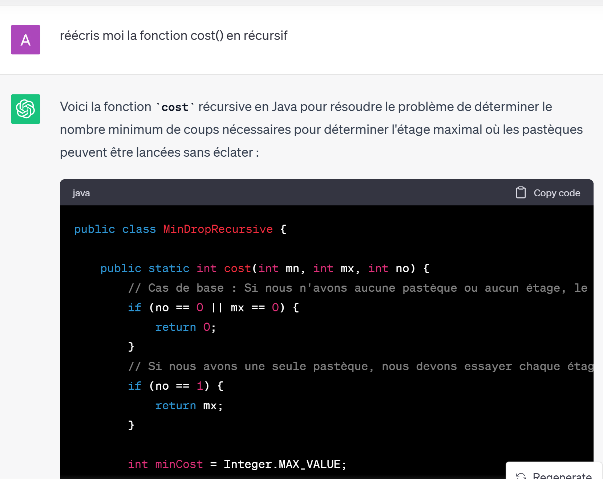
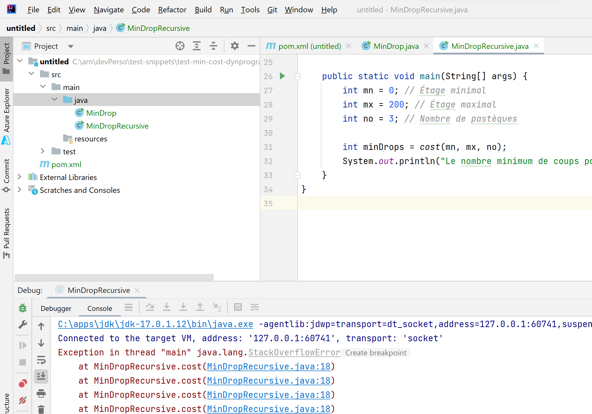
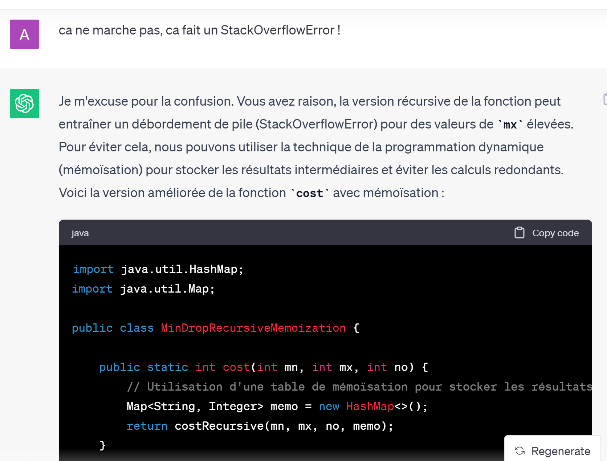
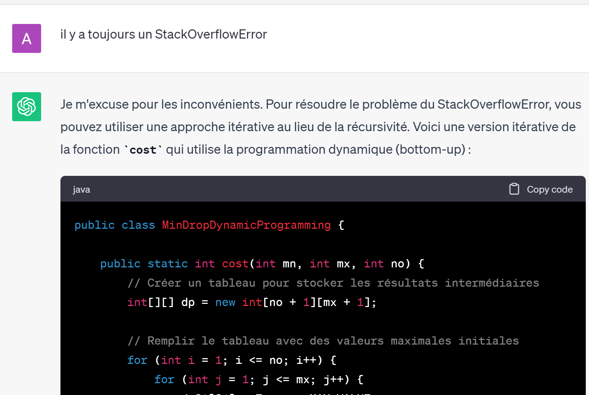
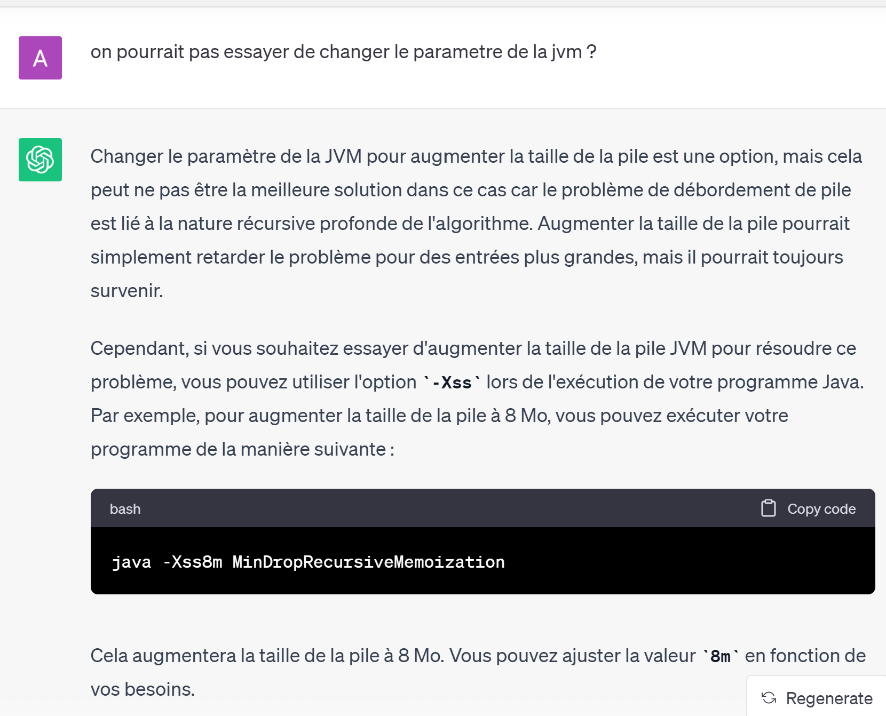
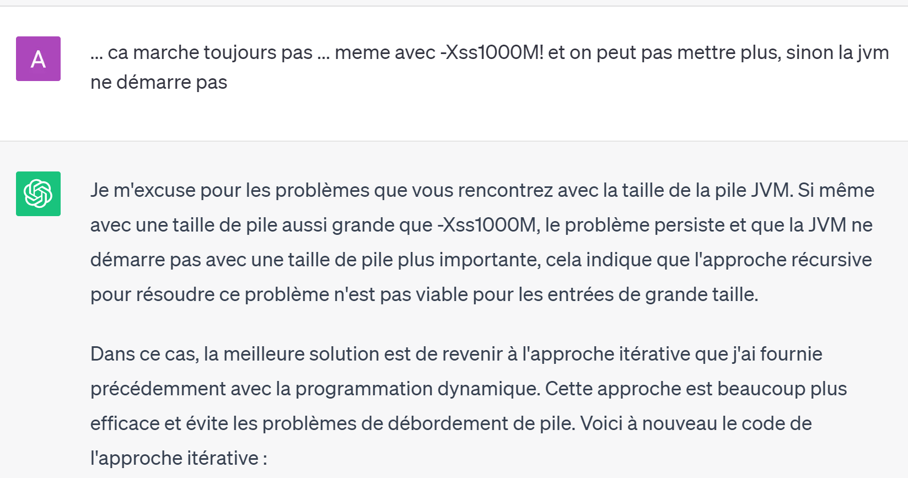

je viens d'essayer d'une facon un peu détournée de résoudre le problème des pasteques...
J'ai demandé a ChatGPT de traduire ce charabia d'hypotheses en francais ... en java

```text
ecris moi un programme en java qui cherche le nombre minimum de coups pour le probleme suivant: checher (par programmation dynamique ou fonction recursive) le noombre d'étages au maximum ou les pastèques peuvent tomber sans éclater

cost(mn=0, mx=200, no=3).
(mn = étage minimal, mx = étage maximal et no = nombre de pastèques)

- les pastèques sont identiques, donc éclatent à partir du même étage (si elles éclatent !)
- les pastèques peuvent éclater dès le 1er étage
- les pastèques peuvent aussi survivre tous les 200 étages
- on veut minimiser le nombre de lancers dans le pire des cas
- on veut aussi TOUJOURS avoir une estimation exacte !
```


public class MinDrop {
```java
    public static int minDrops(int mn, int mx, int no) {
        // Créer un tableau pour stocker les résultats intermédiaires
        int[][] dp = new int[no + 1][mx + 1];

        // Remplir le tableau avec des valeurs maximales initiales
        for (int i = 1; i <= no; i++) {
            for (int j = 1; j <= mx; j++) {
                dp[i][j] = Integer.MAX_VALUE;
            }
        }

        // Initialisation des cas de base
        for (int i = 1; i <= mx; i++) {
            dp[1][i] = i;
        }

        // Remplir le tableau en utilisant la programmation dynamique
        for (int i = 2; i <= no; i++) {
            for (int j = 1; j <= mx; j++) {
                for (int k = 1; k <= j; k++) {
                    int worstCase = 1 + Math.max(dp[i - 1][k - 1], dp[i][j - k]);
                    dp[i][j] = Math.min(dp[i][j], worstCase);
                }
            }
        }

        // Le résultat final est dans dp[no][mx]
        return dp[no][mx];
    }

    public static void main(String[] args) {
        int mn = 0; // Étage minimal
        int mx = 200; // Étage maximal
        int no = 3; // Nombre de pastèques

        int minDrops = minDrops(mn, mx, no);
        System.out.println("Le nombre minimum de coups pour déterminer l'étage maximal est : " + minDrops);
    }
```

Je le lance..



je trouve bien aussi

int minDrops2_100 = minDrops(0, 100, 2);
System.out.println("Le nombre minimum de coups avec 2 pasteques pour déterminer l'étage maximal 100 est : " + minDrops2_100);
=>
Le nombre minimum de coups avec 2 pasteques pour déterminer l'étage maximal 100 est : 14

pas mal...
j'imagine que ChatGPT a appris par coeur cet algo sur internet... ou bien l'a t il vraiment compris?
en tout cas, je lui demande la fonction "cost(mn,mx,no)" ... et il n'a pas utiliser le parametre mn dans son code.


pour continuer sur la lancée (de pasteque...)
J'ai demandé a Chat GPT de mexpliquer cette fois de java ... en français




et encore des questions..



C'est peut etre correct,mais ca marche pas !!  StackOverFlow



je le signale a ChatGPT... ChatGPT me dit ...
trop fort ...



.. Sauf que ca ne fonctionne toujours pas !
il ya encore un StackOverflowError



Il est marrant ce ChatGPT...
J'ai la solution en programmation dynamique, je lui demande en recursive... ca plante ... il me redonne la version en programmation dynamique !... si je lui redemande ?
(ca va faire un StackOverflow dans la discussion en chatGPT et moi ... ? )

essayong autre chose :



... ca marche toujours pas ... meme avec -Xss1000M



C'est assez impressionnant...

dans le meme genre, j'essayais les corrections pour detecter les triches sur les TPs pour mes etudiants.
C'est difficile, tellement il est fort sur les problemes hyper simple... voir un peu difficile

cf le TP : https://github.com/Arnaud-Nauwynck/presentations/blob/main/web/tp-html-javascript-dom.pdf
et la correction dont je parle  : https://github.com/Arnaud-Nauwynck/presentations/blob/main/web/tp-html-javascript-dom-answers-chatgpt.pdf

