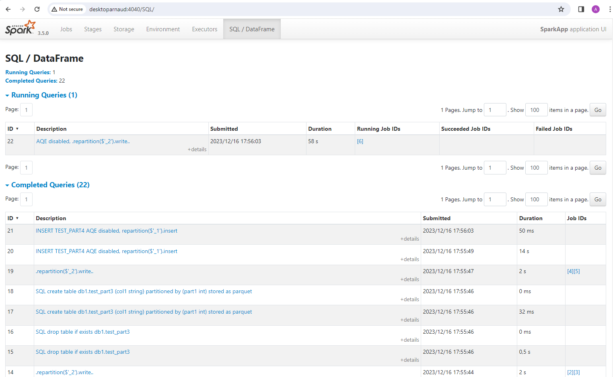

# Test for spark repartition

# spark-shell script for testing ".repartition().write()" variants

```
val ds = spark.createDataset((1 to 1000000).map(x => (s"$x", x % 100)))

spark.sql("drop table if exists db1.test_part1");
spark.sql("create table db1.test_part1 (col1 string) partitioned by (part1 int) stored as parquet");
ds.repartition(25).write.mode("overwrite").insertInto("db1.test_part1");

sc.setCallSite("INSERT TEST_PART2");
spark.sql("drop table if exists db1.test_part2");
spark.sql("create table db1.test_part2 (col1 string) partitioned by (part1 int) stored as parquet");
ds.repartition($"_2").write.mode("overwrite").insertInto("db1.test_part2");

sc.setCallSite("INSERT TEST_PART3");
spark.sql("drop table if exists db1.test_part3");
spark.sql("create table db1.test_part3 (col1 string) partitioned by (part1 int) stored as parquet");
ds.repartition($"_1").write.mode("overwrite").insertInto("db1.test_part3");

sc.setCallSite("INSERT TEST_PART4");
spark.conf.set("spark.sql.adaptive.enabled", "false");
spark.sql("drop table if exists db1.test_part4");
spark.sql("create table db1.test_part4 (col1 string) partitioned by (part1 int) stored as parquet");
ds.repartition($"_1").write.mode("overwrite").insertInto("db1.test_part4");
spark.conf.set("spark.sql.adaptive.enabled", "true")

```




# Launching spark standalone cluster master + worker

## Launching master server

```
/cygdrive/apps/spark/setenv-spark-3.5.cmd

/cygdrive/apps/spark/a_start-master.sh
```

equivalent to 

```
java -cp "${SPARK_HOME}/conf\;${SPARK_HOME}/jars/*;${SPARK_HOME}" \
	-Xmx1g \
	org.apache.spark.deploy.master.Master \
	--host localhost --port 7077 --webui-port 8080
```


## Launching N x worker node(s)

```
/cygdrive/apps/spark/setenv-spark-3.5.cmd

/cygdrive/apps/spark/a_start-worker.sh
```

equivalent to

```
java -cp "${SPARK_HOME}/conf\;${SPARK_HOME}/jars/*;${SPARK_HOME}" \
	-Xmx1g \
	org.apache.spark.deploy.worker.Worker \
	--webui-port 8081 spark://localhost:7077
```


# Launching spark-shell on standalone cluster 

```
spark-shell --master spark://localhost:7077
```


# Launching java application via spark-submit


```
spark-submit --master spark://localhost:7077 \
    --class fr.an.tests.testsparkrepartition.SparkAppMain \
    "file:///c:/ arn/devPerso/test-snippets/test-spark-repartition/target/tests-spark-repartition-0.0.1-SNAPSHOT.jar"
```


custom script on local PC:

```
cd c:/data

source /cygdrive/c/apps/spark/setenv-spark-3.5.sh

/cygdrive/c/apps/spark/a_spark-submit.sh --master spark://localhost:7077 \
    --class fr.an.tests.testsparkrepartition.SparkAppMain \
    "file:///c:/arn/devPerso/test-snippets/test-spark-repartition/target/tests-spark-repartition-0.0.1-SNAPSHOT.jar"

```

equivalent to low-level JVM command:

```
export JVM_OPENS=--add-opens=java.base/java.lang=ALL-UNNAMED \
--add-opens=java.base/java.lang.invoke=ALL-UNNAMED \
--add-opens=java.base/java.lang.reflect=ALL-UNNAMED \
--add-opens=java.base/java.io=ALL-UNNAMED \
--add-opens=java.base/java.net=ALL-UNNAMED \
--add-opens=java.base/java.nio=ALL-UNNAMED \
--add-opens=java.base/java.util=ALL-UNNAMED \
--add-opens=java.base/java.util.concurrent=ALL-UNNAMED \
--add-opens=java.base/java.util.concurrent.atomic=ALL-UNNAMED \
--add-opens=java.base/sun.nio.ch=ALL-UNNAMED \
--add-opens=java.base/sun.nio.cs=ALL-UNNAMED \
--add-opens=java.base/sun.security.action=ALL-UNNAMED \
--add-opens=java.base/sun.util.calendar=ALL-UNNAMED \
--add-opens=java.security.jgss/sun.security.krb5=ALL-UNNAMED


java ${JVM_OPENS} -cp "${SPARK_HOME}/conf\;${SPARK_HOME}/jars/*;${SPARK_HOME}" \
	org.apache.spark.deploy.SparkSubmit \
	--master spark://localhost:7077 \
    --class fr.an.tests.testsparkrepartition.SparkAppMain \
    "file:///c:/ arn/devPerso/test-snippets/test-spark-repartition/target/tests-spark-repartition-0.0.1-SNAPSHOT.jar"

```

# Launching with extraJavaOptions for JVM debug mode

```
/cygdrive/c/apps/spark/a_spark-submit.sh --master spark://localhost:7077 \
    --conf 'spark.driver.extraJavaOptions=-agentlib:jdwp=transport=dt_socket,server=y,suspend=n,address=8000' \
    --conf 'spark.executor.extraJavaOptions=-agentlib:jdwp=transport=dt_s ocket,server=y,suspend=n,address=8001' \
    --class fr.an.tests.testsparkrepartition.SparkAppMain \
    "file:///c:/arn/devPerso/tes t-snippets/test-spark-repartition/target/tests-spark-repartition-0.0.1-SNAPSHOT.jar"
```


# Debugging StackTrace on Executor when calling the partitioner with UDF 

```
lambda$static$75331907$1:22, DebugUDF (fr.an.tests.testsparkrepartition)
call:-1, DebugUDF$$Lambda$2071/0x00000008016bcbf8 (fr.an.tests.testsparkrepartition)
$anonfun$register$352:752, UDFRegistration (org.apache.spark.sql)
apply:-1, UDFRegistration$$Lambda$2079/0x00000008015d8308 (org.apache.spark.sql)
Pmod_0$:-1, GeneratedClass$SpecificUnsafeProjection (org.apache.spark.sql.catalyst.expressions)
apply:-1, GeneratedClass$SpecificUnsafeProjection (org.apache.spark.sql.catalyst.expressions)
$anonfun$prepareShuffleDependency$6:323, ShuffleExchangeExec$ (org.apache.spark.sql.execution.exchange)
$anonfun$prepareShuffleDependency$6$adapted:323, ShuffleExchangeExec$ (org.apache.spark.sql.execution.exchange)
apply:-1, ShuffleExchangeExec$$$Lambda$1663/0x00000008017559e8 (org.apache.spark.sql.execution.exchange)

    def getPartitionKeyExtractor(): InternalRow => Any = newPartitioning match {
      ...
      case h: HashPartitioning =>
        val projection = UnsafeProjection.create(h.partitionIdExpression :: Nil, outputAttributes)
        row => projection(row).getInt(0)  // <=============

$anonfun$prepareShuffleDependency$14:392, ShuffleExchangeExec$ (org.apache.spark.sql.execution.exchange)

apply:-1, ShuffleExchangeExec$$$Lambda$1671/0x0000000801751c00 (org.apache.spark.sql.execution.exchange)

  def prepareShuffleDependency(
      rdd: RDD[InternalRow],
      outputAttributes: Seq[Attribute],
      newPartitioning: Partitioning,
      serializer: Serializer,
      writeMetrics: Map[String, SQLMetric])
    : ShuffleDependency[Int, InternalRow, InternalRow] = {
    val part: Partitioner = newPartitioning match {
      case RoundRobinPartitioning(numPartitions) => new HashPartitioner(numPartitions)
      case HashPartitioning(_, n) =>
        // For HashPartitioning, the partitioning key is already a valid partition ID, as we use
        // `HashPartitioning.partitionIdExpression` to produce partitioning key.
        new PartitionIdPassthrough(n)
      case RangePartitioning(sortingExpressions, numPartitions) =>
        // Extract only fields used for sorting to avoid collecting large fields that does not
        // affect sorting result when deciding partition bounds in RangePartitioner
        val rddForSampling = rdd.mapPartitionsInternal { iter =>
          val projection =
            UnsafeProjection.create(sortingExpressions.map(_.child), outputAttributes)
          val mutablePair = new MutablePair[InternalRow, Null]()
          // Internally, RangePartitioner runs a job on the RDD that samples keys to compute
          // partition bounds. To get accurate samples, we need to copy the mutable keys.
          iter.map(row => mutablePair.update(projection(row).copy(), null))
        }
        // Construct ordering on extracted sort key.
        val orderingAttributes = sortingExpressions.zipWithIndex.map { case (ord, i) =>
          ord.copy(child = BoundReference(i, ord.dataType, ord.nullable))
        }
        implicit val ordering = new LazilyGeneratedOrdering(orderingAttributes)
        new RangePartitioner(
          numPartitions,
          rddForSampling,
          ascending = true,
          samplePointsPerPartitionHint = SQLConf.get.rangeExchangeSampleSizePerPartition)
      case SinglePartition => new ConstantPartitioner
      case k @ KeyGroupedPartitioning(expressions, n, _, _) =>
        val valueMap = k.uniquePartitionValues.zipWithIndex.map {
          case (partition, index) => (partition.toSeq(expressions.map(_.dataType)), index)
        }.toMap
        new KeyGroupedPartitioner(mutable.Map(valueMap.toSeq: _*), n)
      case _ => throw new IllegalStateException(s"Exchange not implemented for $newPartitioning")
      // TODO: Handle BroadcastPartitioning.
    }
    def getPartitionKeyExtractor(): InternalRow => Any = newPartitioning match {
      case RoundRobinPartitioning(numPartitions) =>
        // Distributes elements evenly across output partitions, starting from a random partition.
        // nextInt(numPartitions) implementation has a special case when bound is a power of 2,
        // which is basically taking several highest bits from the initial seed, with only a
        // minimal scrambling. Due to deterministic seed, using the generator only once,
        // and lack of scrambling, the position values for power-of-two numPartitions always
        // end up being almost the same regardless of the index. substantially scrambling the
        // seed by hashing will help. Refer to SPARK-21782 for more details.
        val partitionId = TaskContext.get().partitionId()
        var position = new XORShiftRandom(partitionId).nextInt(numPartitions)
        (row: InternalRow) => {   /// <===========
          // The HashPartitioner will handle the `mod` by the number of partitions
          position += 1
          position
        }

next:577, Iterator$$anon$9 (scala.collection)

  def map[B](f: A => B): Iterator[B] = new AbstractIterator[B] {
    override def knownSize = self.knownSize
    def hasNext = self.hasNext
    def next() = f(self.next())   // <================
  }

write:169, BypassMergeSortShuffleWriter (org.apache.spark.shuffle.sort)

  @Override
  public void write(Iterator<Product2<K, V>> records) throws IOException {
    assert (partitionWriters == null);
    ShuffleMapOutputWriter mapOutputWriter = shuffleExecutorComponents
        .createMapOutputWriter(shuffleId, mapId, numPartitions);
    try {
      if (!records.hasNext()) {
        partitionLengths = mapOutputWriter.commitAllPartitions(
          ShuffleChecksumHelper.EMPTY_CHECKSUM_VALUE).getPartitionLengths();
        mapStatus = MapStatus$.MODULE$.apply(
          blockManager.shuffleServerId(), partitionLengths, mapId);
        return;
      }
      final SerializerInstance serInstance = serializer.newInstance();
      final long openStartTime = System.nanoTime();
      partitionWriters = new DiskBlockObjectWriter[numPartitions];
      partitionWriterSegments = new FileSegment[numPartitions];
      for (int i = 0; i < numPartitions; i++) {
        final Tuple2<TempShuffleBlockId, File> tempShuffleBlockIdPlusFile =
            blockManager.diskBlockManager().createTempShuffleBlock();
        final File file = tempShuffleBlockIdPlusFile._2();
        final BlockId blockId = tempShuffleBlockIdPlusFile._1();
        DiskBlockObjectWriter writer =
          blockManager.getDiskWriter(blockId, file, serInstance, fileBufferSize, writeMetrics);
        if (partitionChecksums.length > 0) {
          writer.setChecksum(partitionChecksums[i]);
        }
        partitionWriters[i] = writer;
      }
      // Creating the file to write to and creating a disk writer both involve interacting with
      // the disk, and can take a long time in aggregate when we open many files, so should be
      // included in the shuffle write time.
      writeMetrics.incWriteTime(System.nanoTime() - openStartTime);

      while (records.hasNext()) {
        final Product2<K, V> record = records.next();  // <=================
        final K key = record._1();
        partitionWriters[partitioner.getPartition(key)].write(key, record._2());
      }


write:59, ShuffleWriteProcessor (org.apache.spark.shuffle)

  def write(
      inputs: Iterator[_],
      dep: ShuffleDependency[_, _, _],
      mapId: Long,
      mapIndex: Int,
      context: TaskContext): MapStatus = {
    var writer: ShuffleWriter[Any, Any] = null
    try {
      val manager = SparkEnv.get.shuffleManager
      writer = manager.getWriter[Any, Any](
        dep.shuffleHandle,
        mapId,
        context,
        createMetricsReporter(context))
      writer.write(inputs.asInstanceOf[Iterator[_ <: Product2[Any, Any]]])  // <===================


runTask:104, ShuffleMapTask (org.apache.spark.scheduler)
runTask:54, ShuffleMapTask (org.apache.spark.scheduler)
runTaskWithListeners:161, TaskContext (org.apache.spark)
run:141, Task (org.apache.spark.scheduler)
$anonfun$run$4:620, Executor$TaskRunner (org.apache.spark.executor)
apply:-1, Executor$TaskRunner$$Lambda$628/0x00000008014acff0 (org.apache.spark.executor)
tryWithSafeFinally:64, SparkErrorUtils (org.apache.spark.util)
tryWithSafeFinally$:61, SparkErrorUtils (org.apache.spark.util)
tryWithSafeFinally:94, Utils$ (org.apache.spark.util)
run:623, Executor$TaskRunner (org.apache.spark.executor)
runWorker:1144, ThreadPoolExecutor (java.util.concurrent)
run:642, ThreadPoolExecutor$Worker (java.util.concurrent)
run:1589, Thread (java.lang)
```
